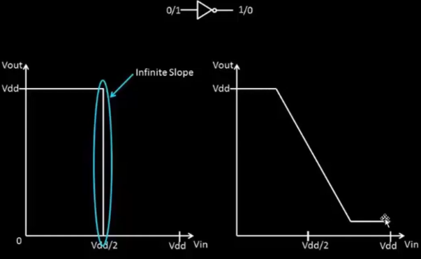

# SKY130 CMOS CIRCUIT DESIGN & SPICE SIMULATION

## **_Overview of the course_**
In this 'CMOS CIRCUIT DESIGN & SPICE SIMULATION WORKSHOP' conducted by [VLSI System Design]( https://www.vlsisystemdesign.com/).We have learned About MOSFET construction,Regions of Operation,characteristic curves ,Drain current equation models.Factors such as velocity saturation effect that affect MOSFET operation was also discussed .CMOS logic for inverter is introduced & it's Voltage transfer characteristics are studied.Effects on varying the PMOS channel dimensions on Switching threshold voltage,Delays,Noise margins are studied,Emphasis was made on Robustness of CMOS during the study.Finally the effect of varying power supply input of CMOS on Voltage transfer characteristics,Gain,Energy consumption & performance(delays) were studied.All the above topic were discussed in detail theoretically & are also simulated using SPICE SIMULATION.The Simulation results obtained are found to be inaccordance with the Theory that was discussed.
## **_Summary of the 5 Day Workshop-Daywise_**
## **_Day 1:Intoduction to MOSFET & Spice Simulation_**
- ### **_1.1 MOSFET(NMOS)BASICS_**.
  
    

 
  - NMOS Construction  
    - MOSFET has four terminals G= GATE D= DRAIN S=SOURCE B=BODY
    - Gate oxide is made up of SiO2 layer that acts as insolation.
    - Metal gate is place over the gate oxide layer 
    - it has a P-type Substrate  
- ### **_1.2 Regions of operation & conditions needed to operate in the region_**
  - Typically MOSFET has three regions of operation 
    - Cutoff region
    - Linear or Resistive region
    - Saturation region
    
  - **_Cutoff region_**
    - 
  
    - 
  
  Vt - threshold voltage is the minimum Vgs voltage at which strong inversion occurs & contionuous n-channel is formed between source to drain.
  In the absence of Vsb, the threshold value Vt becomes Vto (Vt = Vto) but in the presence of Vsb, the threshold value of Nmos is increased to Vto+V1. **_At Cutoff Region, Vgs<=Vt & Id=0_**
  
  - **_Linear region_**
    - When Vgs is increased slightly beyond Vt (**_Vgs >= Vt_**). The MOSFET enters Linear or Resistive region.On providing voltagr Vsb, Drain current starts to flow from source to  drain & it increases with increase in Vds. 
  **The Drain current was derived to be** 
  
    - 
  
  Approximating (Vds^2)/2 = 0. As it is negligible.
  
    - 
  
  - **_Saturation region_**
    - When Vds is increased above (Vgs-Vt), **[Vds >= (Vgs-Vt)]** Mosfet enters into Saturation Region.The Drain Current does not increase with Vds & reaches steady value.
    - Here in the below example we assume Vgs = 1v , Vds = 0.05v , Vt = 0.45v for the MOSFET.let us analyse for various Vds Values
   
    - 
   
    - Here we can observe, as **Vgs-Vds >= Vt** ,the NMOS enters Saturation region.
   
    - The drain current equation is derived to be
   
    - 
   
  
 ### **_1.3 SPICE SIMULATION_**
   - An Introduction to SPICE SIMULATION was provided. Here we learnt about
     - Technology parameters (provided by foundry technology)
     - Netlist
     - Spice commands
     - These are provided as inputs to SPICE SIMULATION Software.The software simulates with the help of inputs & provides us neccessary characteristic.
    
   
   
   The Netlist is used to decribe the cicuit.
   
   
   
   The Typical Charactristic plot (Id vs Vds) of NMOS was simulated using SPICE Software. 
   
   
   
  
## **_Day 2:Effects of Voltge Saturation Effect & Introduction to CMOS_**
- ### **_2.1 Velocity Saturation Effect_**.

  - 
  - Velocity saturation effect is one of the short channel effect.it is predominant in MOSFET having short channel length ( L<= 0.25u).
  - From the plot ,we coul observe that as Electric field is increased beyond a certain point, the Voltage does not increase & saturates to a steady value.
  - 
- ### **_2.2 Effects of Velocity Saturation Effect_**.

  - 
     - In this (Id vs Vds) graph we could see that in longer nodes the variation of drain current with respect to Vgs is of Quadratic nature & in shorter nodes the variation        drain current with respect to Vgs is of Linear nature.

  - 
    - In this (Id vs Vgs) graph, the Quadaratic increase of drain current with respect to Vgs for longer nodes is shown on the left & The linear increase of drain current with respect to Vgs for shorteer nodes is shown on the right.
   
  - 
    - hence for Mosfet with Shorter nodes, there exist 4 Regions of operation as compared to Mosfet with Longer nodes which has only three regions of operation
    - The Drain current is also modified to account for the Velocity saturation Effect.(Vdsat is a Technology parameter provided by the foundry).

  -    
     - The (Id vs Vds) plot obtained through Simulation for MOSFET with Short Channel(L=0.25u).
     - We can observe linear variation of drain current with respect to Vgs.  
      
  -   
      - The (Id vs Vgs) plot obtained through Simulation for MOSFET with Short Channel(L=0.25u).
      - We can observe linear variation of drain current with respect to Vgs.  
    
- ### **_2.3 Introduction To CMOS Logic_**.
  -  
     - This is the CMOS logic for the inverter.It is the Series arrangement of PMOS & NMOS,with Drains of the mosfets tied together 
     - Vgsp - Gate to source voltage of PMOS
     - Vdsp - Drain to source voltage of PMOS 
     - Vgsn - Gate to source voltage of NMOS
     - Vdsn - Drain to source voltage of NMOS
     - Vin - Input voltage to CMOS. it is the potential driven at Gate terminals of both NMOS & PMOS.
     - Vout - Output voltage provided to the load.
     - CL   - equivalent capacitance appearing at the load terminals.
     - Vss -  Ground teriminal
     - Vdd -  Supply voltage for NMOS
    
  -  
     - Typical inverter logic is : if Vin = High , then Vout = Low & if Vin = Low , then Vout = high. 
     - In the image on the left, We can observe that Equivalent circuit for Vin=Vdd & Vout=0 (PMOS in OFF state & NMOS in ON state)
     - In the image on the right,We can observe that Equivalent circuit for Vin=0 & Vout=Vdd (PMOS in ON state & NMOS in OFF state)
     
  -  
     - From Observations, Voltage & current Equations for NMOS & PMOS are derived from CMOS circuit.
     - (Id vs Vds) curves are plotted for Both NMOS & PMOS separately

  -  
     - With the help of equations & (Id vs Vds) curves, the load curves of NMOS & PMOS are plotted as shown above.
     - We obtained this load ,so as understand the CMOS characteristic in terms of Vin & Vout.( dependency of Vgsn, Vdsn, Vgsp, Vdsp are elimiated in this plot)
  
  -  
     - Load curves of both NMOS & PMOS are plotted on same graph
     
  -  
     - CMOS Voltage transfer characteristics is finally plotted from load curves of NMOS & PMOS.
     - Vm is the Switching Threshold voltage at which Vin=Vout.

## **_Day 3:CMOS_Characteristics & Effects of varying PMOS Channel width_**

- ### **_3.1 Channel width variation of PMOS affects Switching threshold voltage_**.  

  -   
     - We have transfer characteristic curves of CMOS with lesser channel width on left & CMOS with higher channel width on right.
     - We can observe that the Switching Threshold voltage is shifted towards right.
       
  -  
     - Voltage transfer characteristics of CMOS is simulated using Spice & Switching threshold voltage (Vin = Vout = Vm) is obtained from the plot.
     
  -  
     - From the above Equation, Switching threhold voltage can be calculated mathematically for a given set of parameters. 
  
- ### **_3.2 Channel width variation of PMOS affects Delay time_**.

  -  
     - A pulse of peak 2.5V,time period - 2ns,Ton - 1ns is supplied at Vin. & th corresponding Vout response was plotted in this curve using Spice Simulation.
     - Blue waveform depicts Vin & ref waveform depicts Vout.
     - Rise delay = (Time at which Vin rises to 50%(1.25V) of peak time - Time at which Vout rises to 50%(1.25V) of its peak value)
     - Fall delay = (Time at which Vin falls to 50%(1.25V) of peak time - Time at which Vout falls to 50%(1.25V) of its peak value)
     
  -  
     - This table depicts the variation of Switching threshold voltage (Vm),Delay time (Rise & fall delay) with respect to variation in PMOS Channel width variation.
     - As PMOS channel width is increased,Switching threshold voltage (Vm) & FAll delay increases.
     - But When PMOS channel width is decreased, Rise delay decreases drastically.
     
## **_Day 4: Effects of varying PMOS Channel width on Noise margin_**

- ### **_4.1 Ideal Characteristics of Inverter_**.
  -   
  -   In this plot we could observe that Switching from ON to OFF happens when Vin is 50% of Vout.
  -   The ideal Characteristics is shown on left whereas Semi-ideal characteristics of inverter is shown on right.
  
- ### **_4.2 Characteristics of CMOS Inverter_**.
  -   
  -   In this plot we could observe that At SLope of -1, x-axis cordinates obtained are Vih & Vil.
  -   Vih < Voh , as the output should be high enough to set logic 1 at input of next inveter connected.
  -   Vil > Vol , as the output should be low enough to set logic 0 at input of next inveter connected.
  
  -   
  -   In this image, parameters are plotted on the number line to compare their magnitudes.
  -   Voh > Vih > Vil > Vol .This is the condition necessary for operation of inverter.
  
- ### **_4.3 Channel width variation of PMOS affects Noise margin_**  
  -   
  -   In this table,we can observe that as channel width of PMOS is increased,Noise margin Nmh increases & Noise margin Nml decreases
   
  -   
  -   WE have simulated the voltage transfer characteristics of CMOS inverter & found the Noise margin (Nmh & Nml)
  -   Generally Digital design is cariied out in the Region of Nmh & Nml. & Analog design is carried out in the range between Vih & Vil.

## **_Day 5: Variation of power supply(Vdd) to CMOS & its Effect on Voltage transfer characteristics (Vout vs Vin)_**

 - ### **_5.1 Effect of Power supply(vdd)_**.
   -     
   -   
   -    Vdd is varied with a step of 0.5 V From 2.5V to 0.5V . The Voltage Transfer Characteristics is plotted by Sweeping Vin for each value of Vdd.
   -    We could observe that shape of Curve is still intact but the the size of curve reduces.Vout vs Vin curves were simulated for a range of power supply Vdd(0.8           to 1.8v)
   -    Red waveform - Vdd = 1.8v
   -    Blue waveform - Vdd = 1.6v
   -    yellow waveform - Vdd = 1.4v
   -    green waveform - Vdd = 1.2v
   -    white waveform - Vdd = 1.0v 
   -    Brown waveform - Vdd = 0.8v
   
 - ### **_5.2 Advantages & disadvantages of Power supply(vdd) variation_**.
   - Advantages of operating CMOS with minimum power supply over CMOS with standard power supply are Improved Gain, Reduced Energy consumption(90&) 
   - But the performance (Rise & fall delay) is found to be poor during this study. & the Simulation results obtained using Spice were found to support the study.
    
    
    
    
 ## **_References_**

- [https://github.com/kunalg123/sky130CircuitDesignWorkshop](https://github.com/kunalg123/sky130CircuitDesignWorkshop)
- [https://www.vsdiat.com/](https://www.vsdiat.com/)
- [https://www.vlsisystemdesign.com/](https://www.vlsisystemdesign.com/)
   
  
